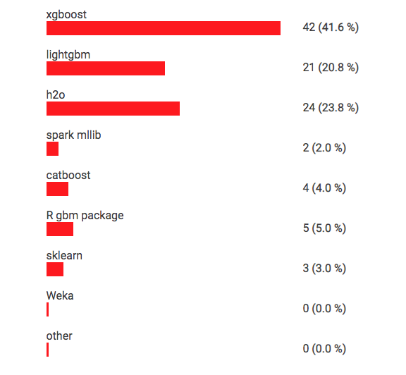
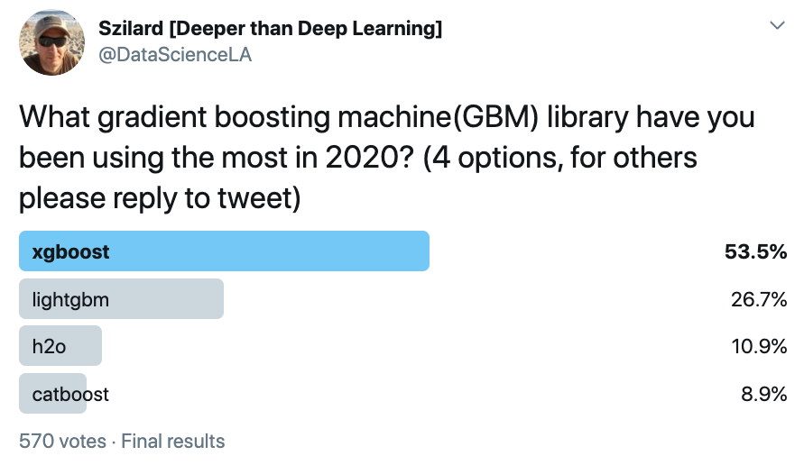
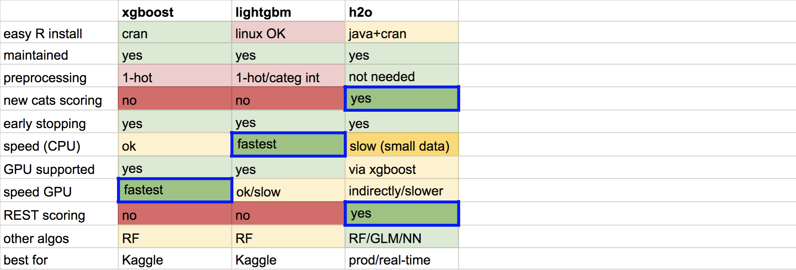

# GBM Performance

Performance of the top/most widely used open source gradient boosting machines (GBM)/ boosted trees (GBDT)
implementations (h2o, xgboost, lightgbm, catboost) 
on the airline dataset (100K, 1M and 10M records) and with `100` trees, depth `10`, learning rate `0.1`.


## Popularity of GBM implementations

Poll conducted via twitter (April, 2019):



More recent twitter poll (September, 2020):




## How to run/reproduce the benchmark

Installing to latest software versions and running/timing is easy and fully automated with docker: 

### CPU

(requires docker)

```
git clone https://github.com/szilard/GBM-perf.git
cd GBM-perf/cpu
sudo docker build --build-arg CACHE_DATE=$(date +%Y-%m-%d) -t gbmperf_cpu .
sudo docker run --rm gbmperf_cpu
```

### GPU

(requires docker, NVIDIA drivers and the `nvidia-docker` utility)

```
git clone https://github.com/szilard/GBM-perf.git
cd GBM-perf/gpu
sudo docker build -t gbmperf_gpu .
sudo nvidia-docker run --rm gbmperf_gpu
```


## Results

### CPU 

r4.8xlarge (32 cores, but run on physical cores only/no hyperthreading) with software as of 2020-09-08:

Tool              | Time[s] 100K | Time[s] 1M  |  Time[s] 10M  |   AUC 1M  |   AUC 10M
------------------|--------------|-------------|---------------|-----------|------------
h2o               |   14         |   16        |     90        |   0.762   |   0.776
xgboost           |   **0.8**    |   5.5       |     70        |   0.748   |   0.754
**lightgbm**      |   2.1        |   **4.0**   |     **20**    |   0.765   |   0.792
catboost          |   3.8        |   10        |     80        |   0.734   |   0.735 


### GPU

p3.2xlarge (1 GPU, Tesla V100) with software as of 2020-09-08:

Tool            | Time[s] 100K | Time[s] 1M  |  Time[s] 10M  |   AUC 1M  |   AUC 10M
----------------|--------------|-------------|---------------|-----------|------------
h2o xgboost     |   6.4        |    14       |     55        |   0.749   |   0.756  
**xgboost**     |   3.4        |  6.4        |   **11**      |   0.748   |   0.754
lightgbm        |   8          |    12       |     50        |   0.763   |   0.792
catboost        |   **1.8**    |    **4.7**  |     36        | 0.732 ?!  |   0.736 ?!


## Additional results 

Some additional studies obtained "manually" (not fully automated with docker as the main benchmark above).
Thanks [@Laurae2](https://github.com/Laurae2) for lots of help with some if these. 

### Faster CPUs

AWS has now better CPUs than r4.8xlarge (Xeon E5-2686 v4 2.30GHz, 32 cores), for example with higher CPU frequency 
c5.9xlarge (Xeon Platinum 8124M 3.00GHz, 36 cores) or more number of cores 
m5.12xlarge (Xeon Platinum 8175M 2.50GHz, 48 cores).

c5.9xlarge and m5.12xlarge are typically 20-50% faster than r4.8xlarge, for larger data more cores (m5.12xlarge) is the best, 
for smaller data high-frequency CPU (c5.9xlarge) is the best. Nevertheless, the ranking of libs by
training time stays the same for a given data size when changing CPU. More details
[here](https://github.com/szilard/GBM-perf/issues/13).


### Multi-core scaling (CPU)

While GBM trees must be grown sequentially (as building each tree depends on the results of the previous ones), GBM training can be parallelized e.g. 
by parallelizing the computation in each split (more exactly the histogram calculations). Modern CPUs have many cores, but the scaling of these GBM implementations is far 
worse from being proportional to the number of cores. Furthermore, it has been known for long (2016) that xgboost (and later lightgbm) slow down (!) on systems
with 2 or more CPU sockets or when hyperthreaded cores are used. These problems have been very recently mitigated (2020), but it is
still usually best to restrict your training process to the physical cores (avoid hyperthreading) and only 1 CPU socket (if the server has
2 or more sockets). 

Even if only physical (no hyperthreading) CPU cores are used on 1 socket only, the speedup for example from 1 core to 16 cores 
is not 16x, but (on r4.8xlarge):

data size   |  h2o |  xgboost | lightgbm | catboost
------------|------|----------|----------|----------
0.1M        |  3x  |    6.5x  |   1.5x   |      3.5x
 1M         |  8x  |    6.5x  |     4x   |      6x
 10M        | 24x  |    5x    |  7.5x    |      8x

with more details [here](https://github.com/szilard/GBM-perf/issues/29#issuecomment-691646736). In fact the scaling was worse until
very recently, for example xgboost was at 2.5x at 1M rows (vs 6.5x now) before several optimizations have been implemented in 2020. 


### Multi-socket CPUs

Most high-end servers have nowadays more than 1 CPU on the motherboard. For example c5.18xlarge has 2 CPUs
(2x of the c5.9xlarge CPUs mentioned above), same for r4.16xlarge or m5.24xlarge. There are even EC2 instances with 
4 CPUs e.g. x1.32xlarge (128 cores) or more.

One would think more CPU cores means higher training speed, though because of RAM topology and NUMA, most of the above tools
used to run slower on 2 CPUs than 1 CPU (!) until very recently (2020). The slowdown was sometimes pretty 
dramatic, e.g. 2x for lightgbm or 3-5x for xgboost even for the largest data in this benchmark. 
Very recently these effects have been mitigated by several optimizations in lightgbm and even more notably in xgboost. 
More details on the NUMA issue 
[here](https://github.com/szilard/GBM-perf/issues/13),
[here](https://github.com/szilard/GBM-multicore) and
[here](https://github.com/szilard/GBM-perf/issues/29).

Currently, the difference in training speed e.g. on r4.16xlarge (2 sockets, 16 cores + 16 HT each, so total of 64 cores) between 
16 physical cores and 64 total cores is:

data size   |  h2o |  xgboost | lightgbm | catboost
------|-----|----------|----------|----------
0.1M  |  -40%     |    -50%        |        -70%    |      15%
   1M  |  -15 %    |    -2%        |     -60%         |      -20%
 10M  | 25%   |    35%          |  -20%          |      10%

where negative numbers mean on 64 cores it is slower than on 16 cores (by that much %) (e.g. -50% means a decrease in speed by 50% that is
a doubling of training time). These numbers were much much worse until very recently (2020), for example training time (sec) for xgboost 1M rows:

cores       |  May 2019  | Sept 2020
------------|------------|------------
1           |    30      |   34
16 (1so)    |    12      |   5.1
64 (2so+HT) |   120      |   5.2

that is xgboost was 10x slower on 64 cores vs 16 cores and it was slower on 64 cores vs even 1 core (!). One can see that the recent
optimizations have improved both the multicore scaling and the NUMA (multi-socket) issue.


### 100M records and RAM usage

Results on the fastest CPU (most cores, 1 socket, see above why this is the fastest) and the fastest GPU on EC2.
The data is obtained by replicating the 10M dataset 10x, so the AUC is not indicative of a learning curve, just used to
see if it is equal approximately the 10M AUC (it should be).

For the CPU runs, "RAM train" is measured as the increase in memory usage during training (on top of the RAM used by the data). 
For the GPU runs, the "GPU memory" usage is the total GPU memory used (cannot separate training from copies of the data),
while the "extra RAM" is the additional RAM used by some of the tools (on the CPU) if any.

CPU (m5.12xlarge):

Tool              | time [s]   | AUC       | RAM train [GB]
------------------|------------|-----------|-------------------------
h2o               | 520        |  0.775    |   8
xgboost           | 510        |  0.751    |  15
**lightgbm ohe**  | **310**    |  0.774    |   **5**
catboost          | 930        |   0.736   |  50


GPU (Tesla V100):

Tool              | time [s]    |  AUC      | GPU mem [GB]   | extra RAM [GB]
------------------|-------------|-----------|----------------|----------------
h2o xgboost       | 270         | 0.755     | 4              | 30
**xgboost**       | **80**      | 0.756     | 6              | **0**
lightgbm ohe      | 400         | 0.774     | 3              | 6
catboost          | crash (OOM) |           | >16            | 14

catboost GPU crashes out-of-memory on the 16GB GPU.

h2o xgboost on GPU is slower than native xgboost on GPU and also adds
a lot of overhead in RAM usage ("extra RAM") (this must be due to some pre- and post-processing of data in h2o as one can
see by looking at the GPU utilization patterns as discussed next).

More details [here](https://github.com/szilard/GBM-perf/issues/14).


### GPU utilization patterns

For the GPU runs, it is interesting to observe the GPU utilization patterns and also the CPU utilization meanwhile
(usually 1 CPU thread).

xgboost uses GPU at ~80% and 1 CPU core at 100%.

h2o xgboost shows 3 phases: first only using CPU at ~30% (all cores) and no GPU, then GPU at ~70% and CPU at 100%, then
no GPU and CPU at 100%. This means 3-4x longer training time vs native xgboost. 

lightgbm uses GPU at 5-10% and meanwhile CPU at 100% (all cores). It can be made to use 1 CPU core only (`nthread = 1`), but
then it may be slower.

catboost uses GPU at ~80% and 1 CPU core at 100%. Unlike the other tools catboost takes all the GPU memory available when it
starts training no matter of the data size (so we don't know how much memory it needs by using the standard monitoring tools).

More details [here](https://github.com/szilard/GBM-perf/issues/11).


### Spark MLlib 

In my previous broader benchmark of ML libraries, Spark MLlib GBT (and random forest as well) performed very poorly 
(10-100x running time vs top libs, 10-100x memory usage and an accuracy issue for larger data) and therefore it
was not included in the current GBM/GBT benchmark. However, people might still be interested if there has been any
improvements since 2016 and Spark 2.0.

With Spark 2.4.2 as of 2019-05-05  the accuracy issue for larger data has been fixed, but the
speed and the memory footprint did not improve:

size  | time lgbm [s] | time spark [s] | ratio | AUC lgbm | AUC spark
------|---------------|----------------|-------|----------|-------------
100K  |           2.4 |           1020 | 425   |    0.730 | 0.721
1M    |           5.2 |           1380 | 265   |    0.764 | 0.748
10M   |            42 |           8390 | 200   |    0.774 | 0.755

(compared to lighgbm CPU) (Spark code [here](https://github.com/szilard/GBM-perf/tree/master/analysis/spark))

So Spark MLlib GBT is still 100x slower than the top tools. In case you are wondering if more nodes or
bigger data would help, the answer in nope (see below).

#### Spark MLlib on 100M records and RAM usage

Besides being slow, Spark also uses 100x RAM compared to the top tools. In fact, on 100M records 
(20GB after being loaded from disk and cached in RAM) it crashes out-of-memory even on servers with almost 1 TB RAM.

      |       | 100M      |       |            | 10M      |       |  
----- | ----- | --------- | ----- | ---------- | -------- | ----- | --
trees | depth | time [s]  | AUC   | RAM [GB]   | time [s] | AUC   | RAM [GB]
1     | 1     | 1150      | 0.634 | 620        | 70       | 0.635 | 110
1     | 10    | 1350      | 0.712 | 620        | 90       | 0.712 | 112
10    | 10    | 7850      | 0.731 | 780        | 830      | 0.731 | 125
100   | 10    | crash OOM |       | >960 (OOM) | 8390     | 0.755 | 230

(100M ran on x1e.8xlarge [32 cores, 960GB RAM], 10M ran on r4.8xlarge [32 cores, 240GB RAM])

(compare this with 100M records 100 trees depth 10, lightgbm 5GB RAM usage)

More details [here](https://github.com/szilard/GBM-perf/issues/18). 

Note the situation is much better for linear models in Spark MLlib, only 3-4x slower and 10x more memory
footprint vs h2o for example, see results [here](https://github.com/szilard/GBM-perf/issues/20) (and training
linear models is much much faster than trees, so training times are reasonable even for large data).

#### Spark on a cluster

Results on a EMR cluster with master+10 slave nodes and comparison with local mode on 1 server (and 
"cluster" with 1 master+1 slave). To run in reasonable time only 10 trees (depth 10) have been used.

size | hw | nodes | cores | partitions | time [s] | RAM [GB] | avail RAM [GB]
-- | -- | -- | -- | -- | -- | -- | --
10M | local | r4.8xl | 32 | 32 | 830 | 125 | 240
10M | Cluster_1 | r4.8xl | 32 | 64 | 1180 | 73 | 240
10M | Cluster_10 | r4.8xl | 320 | 320 (m) | 330 |   | 2400
100M | local | x1e.8xl | 32 |   | 7850 | 780 | 960
100M | Cluster_10 | r4.8xl | 320 | 585 | 1825 | 10*72 | 2400

100M records data is "big" enough for Spark to be in the "at scale" modus operandi. However, the 
computation speed and memory footprint inefficiencies of the algorithm/implementation are so
huge that no cluster of any size can really help. Furthermore larger data (billions) would mean even more 
prohibitively slow training (many hours/days) for any reasonable cluster size (remember, the timings
above are for 10 trees, any decent GBM would need at least 100 trees).

Also, the fact that Spark has so huge memory footprint means that one can run e.g. lightgbm
instead on much less RAM, so that even larger datasets would fit in the RAM of a single server.
Results for lightgbm for comparison with the above Spark cluster results (10 trees):

size | hw | cores | time [s] | AUC | RAM [GB] | avail RAM [GB]
-- | -- | -- | -- | -- | -- | --
10M | r4.8xl | 16 (m) | 7 | 0.743 | 4 | 240
100M | r4.8xl | 16 (m) | 60 | 0.743 | 13(d)+5 | 240

More details [here](https://github.com/szilard/GBM-perf/issues/21).


## Recommendations

If you **don't have a GPU, lightgbm** (CPU) trains the fastest.

If you **have a GPU, xgboost** (GPU) is very fast (and depending on the data, your hardware etc.
often faster than the above mentioned lightgbm on CPU).

If you consider deployment, **h2o has the best ways to deploy** as a real-time
(fast scoring) application.

Note, however, there are a lot more other criteria to consider when you choose which tool
to use, e.g.:



You can find more info in my talks at several conferences and meetups with many of them having video
recordings available, for example my talk
at Berlin Buzzwords in 2019, video reording [here](https://www.youtube.com/watch?v=qjuizRba3ZQ), slides
[here](https://bit.ly/szilard-talk-berlbuzz19).

