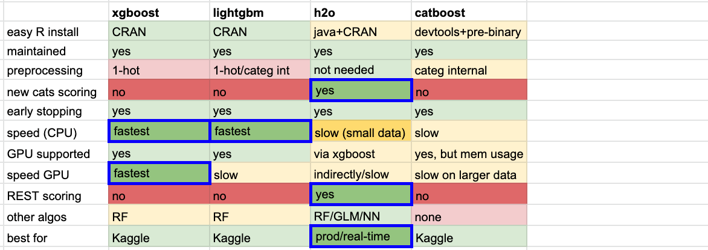

## GBM Performance

Performance of the top/most widely used open source GBM implementations (h2o, xgboost, lightgbm, catboost) 
on the airline dataset (100K, 1M and 10M records) and with `100` trees, depth `10`, learning rate `0.1`.


### Popularity of GBM implementations

Poll conducted mainly via twitter (April, 2019):


### How to run/reproduce the benchmark/results

Installing to latest software versions and running/timing is fully automated with docker: 

#### CPU

(requires docker)

```
git clone https://github.com/szilard/GBM-perf.git
cd GBM-perf/cpu
sudo docker build --build-arg CACHE_DATE=$(date +%Y-%m-%d) -t gbmperf_cpu .
sudo docker run --rm gbmperf_cpu
```

#### GPU

(requires docker, nvidia drivers and the `nvidia-docker` utility)

```
git clone https://github.com/szilard/GBM-perf.git
cd GBM-perf/gpu
sudo docker build -t gbmperf_gpu .
sudo nvidia-docker run --rm gbmperf_gpu
```


### Results

#### CPU 

r4.8xlarge (32 cores, but run on physical cores only/no hyperthreading) with software as of 2019-04-29:

Tool         | Time[s] 100K | Time[s] 1M  |  Time[s] 10M  |   AUC 1M  |   AUC 10M
-------------|--------------|-------------|---------------|-----------|------------
h2o          |   16         |   20        |    100        |   0.762   |   0.776
xgboost      |   3.8        |   12        |     78        |   0.749   |   0.755
lightgbm     |   **2.4**    |    **5.2**  |     42        |   0.764   |   0.774
catboost     |   5.4        |   50        |    490        |   0.740   |   0.744 


#### GPU

p3.2xlarge (1 GPU, Tesla V100) with software as of 2019-04-29:

Tool            | Time[s] 100K | Time[s] 1M  |  Time[s] 10M  |   AUC 1M  |   AUC 10M
----------------|--------------|-------------|---------------|-----------|------------
h2o xgboost     |   9          |    14       |     60        |   0.749   |   0.756  
xgboost         | **2.4**      |  **4.8**    |   **13**      |   0.750   |   0.756
lightgbm        |              |             |               |           |  
catboost        |   3.9        |    10       |    135        |   0.742   |   0.750 


### Recommendations

If you don't have a GPU, lightgbm (CPU) trains the fastest.

If you have a GPU, xgboost (GPU) is also very fast (and depending on the data, your hardware etc.
often faster than the above mentioned lightgbm on CPU).

If you consider deployment, h2o has the best ways to deploy as a real-time
(fast scoring) application.

Note, however, there are a lot more other criteria to consider when you choose which tool
to use.

More info in my eRum 2018 R conference talk 
(video recording [here](https://www.youtube.com/watch?v=DqS6EKjqBbY),
slides [here](https://speakerdeck.com/szilard/better-than-deep-learning-gradient-boosting-machines-gbm-in-r-erum-conference-budapest-may-2018)), and a summary comparison table here:




